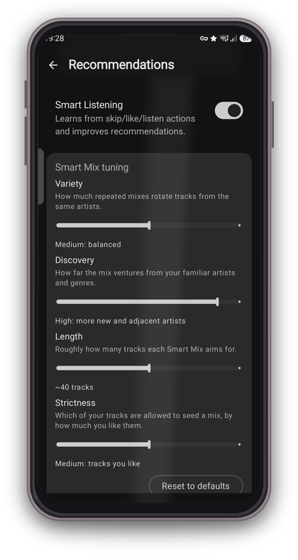
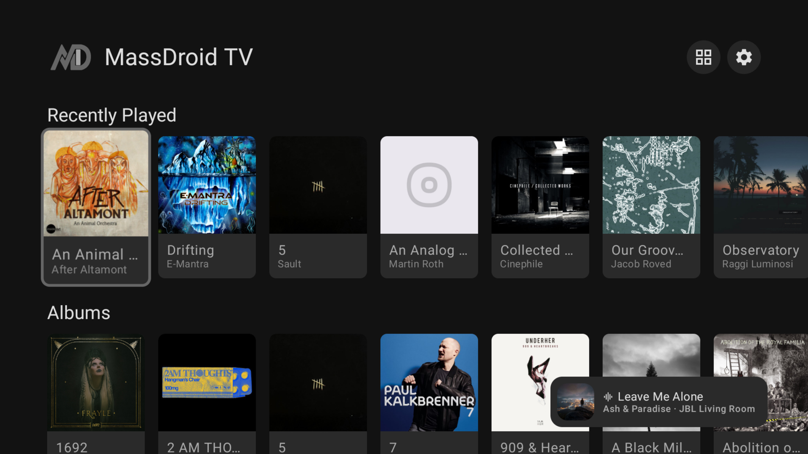
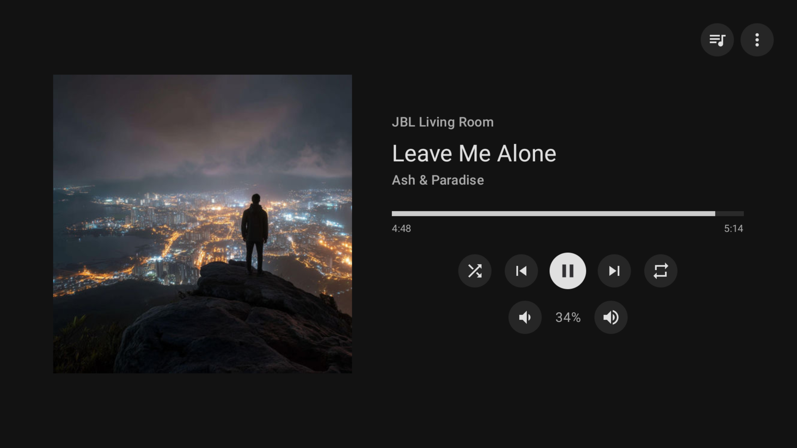

# MassDroid

**Native Android client for [Music Assistant](https://music-assistant.io/), the open-source music server that integrates all your music sources and players.**

 

_This app is an unofficial third-party client and is not affiliated with the Music Assistant project._

---

MassDroid is a full-featured Music Assistant companion app built around music exploration and discovery. It gives you complete remote control over all your MA players while also learning from your listening habits to surface personalized recommendations, generating Smart Mix playlists and genre radio stations entirely on-device, enriching your library with metadata from Last.fm, and helping you discover similar artists across all your music providers. Small footprint, with no ads, no trackers, and no cloud dependencies.

## Contents

- [What's New](#whats-new-)
- [Screenshots](#screenshots)
- [Core Features](#core-features)
- [Exploration & Discovery](#exploration--discovery)
- [Follow Me](#follow-me)
- [Sendspin & Acoustic Calibration](#sendspin--acoustic-calibration)
- [Android Auto](#android-auto)
- [Recommendation Engine](#recommendation-engine)
- [How It Works](#how-it-works)
- [Requirements](#requirements)
- [Installation](#installation)
  - [Stable release](#stable-release)
  - [Dev build](#dev-build-latest-features-may-be-unstable)
- [Configuration](#configuration)
- [Permissions](#permissions)
- [Tech Stack](#tech-stack)
- [Documentation](#documentation)
- [License](#license)
- [Support](#support)

## What's New 

- New DSP Effects: a sound compressor for phone-as-speaker that evens out the volume, gently lifts quiet or low-recorded tracks and tames loud peaks. Pick Off, Soft, Medium or Hard (great for the car or late-night listening).
- DSP Effects: optional High-end audio (noise-shaped dithering) for cleaner detail in quiet passages and fades.
- Car audio: choose which Bluetooth devices start at full volume on connect, so the car begins loud and its own dial takes over (Settings, Sendspin).
- Car audio: the volume no longer drops or jumps when the track changes in the car.
- Car audio: play, pause and skip stay on your phone in the car and never jump to a remote speaker.
- Bluetooth volume: the volume keys now move in finer, more accurate steps.
- Connection: the app reconnects on its own when the network comes back (after roaming, a Wi-Fi change, or a longer drop).
- Follow Me: more reliable room detection, and it keeps working even when nothing is playing.
- Recommendations: mixes feel more varied and less front-loaded with your own tracks.
- Sync speakers: you can now set the playback delay for receivers that only expose it (e.g. the iOS Sendspin app), instead of a dead-end note.
- Diagnostics: sharing logs no longer freezes the app.
- More consistent Settings styling.

## Screenshots

### Phone

  &nbsp;&nbsp;
  &nbsp;&nbsp;
  

  &nbsp;&nbsp;
  &nbsp;&nbsp;
  

  

### Android TV

  &nbsp;&nbsp;
  

### Android Auto

  

## Core Features

- **Discover Home** : Dynamic recommendation sections with recently played, top picks, genre radio, and Smart Mix
- **Library Browsing** : Artists, Albums, Tracks, Playlists, Radio, Audiobooks, and Browse with search, sort, grid/list views, and provider filtering. Genre-based search finds artists, albums, and tracks by genre when your library has been enriched with Last.fm tags.
- **Artist & Album Detail** : Rich detail views with descriptions, genres, similar artists, and now-playing indicators
- **Player Controls** : Play, pause, skip, seek, volume, shuffle, repeat across all MA players
- **Now Playing** : Full-screen player with album art, seek bar, favorite toggle, synced/plain lyrics, tap-to-seek on synced lyric lines, timing adjustment, and artist blocking
- **Audiobooks** : Dedicated library section with chapter list, chapter-aware transport, 30-second skip back/forward, and H:M:S timing
- **Queue Management** : View, drag-to-reorder, transfer between players, and manage the playback queue with action sheets
- **Favorites** : Mark artists, albums, tracks, and playlists as favorites, filter library by favorites
- **Phone as Speaker** : Sendspin protocol turns your phone into a Music Assistant player, solo or grouped with other MA players in tight sync. Audio streams as Opus or FLAC over WebSocket, decoded and played through your phone speaker, headphones, or Bluetooth device. Smart mode can switch format automatically based on network conditions. A built-in acoustic calibration measures real Bluetooth latency via microphone so grouped playback stays in sync even on wireless speakers. A streaming status sheet shows live sync graph, output latency, network mode, and a static delay control.
- **Follow Me** : Room detection with auto-transfer, per-room playlists, volume, and scheduling. Uses BLE fingerprinting by default, with optional Wi-Fi BSSID or SSID matching for distinct locations.
- **Artist Blocking** : Block any artist from all recommendations, radio stations, and Smart Mix results
- **Media Session** : Android media notification with playback controls
- **Player Settings** : Rename players, set icons, configure crossfade, volume normalization, and streaming codec
- **Android TV** : Full client for Shield and Google TV: browse the library, control any player, and use the TV as a synced speaker
- **Connection Diagnostics** : Live latency graph with roundtrip stats and server version info
- **mTLS Support** : Client certificate authentication for secure remote access
- **MiniPlayer** : Persistent mini player bar across all screens

## Exploration & Discovery

MassDroid can enrich your library with Last.fm metadata, surface similar artists, build Smart Mix queues, and generate genre radio stations from local listening history.

See [Recommendation Engine](docs/recommendations.md) for details.

## Follow Me

Walk between rooms and your music follows you. MassDroid uses BLE fingerprinting, optional Wi-Fi location hints, and motion-gated scans to detect where playback should move.

See [Follow Me](docs/follow-me.md) for setup guidance, room detection tips, tools, and troubleshooting.

## Sendspin & Acoustic Calibration

Sendspin turns your phone into a Music Assistant player. Acoustic calibration measures real output-route latency, including Bluetooth latency, so grouped playback stays aligned.

See [Sendspin & Acoustic Calibration](docs/sendspin.md) for calibration steps, sync behavior, and privacy notes.

## Android Auto

MassDroid supports Android Auto through a Media3 media library session with browse categories, queue playback, now-playing metadata, and player controls. Debug or sideloaded builds may require Android Auto's Unknown sources developer setting.

See [Android Auto](docs/android-auto.md) for setup notes, common quirks, and testing tips.

## Recommendation Engine

MassDroid learns from local listening history to power Smart Mix, genre radio, similar artists, and recommendation insights. Recommendation data stays on-device in a local Room database.

See [Recommendation Engine](docs/recommendations.md) for the scoring model and discovery features.

## How It Works

MassDroid communicates with your Music Assistant server over a persistent WebSocket connection. All player state, library data, queue changes, and favorites are synced in real time through server-pushed events. The app never polls; updates appear instantly as they happen on the server or from other clients.

When Sendspin is enabled, the phone registers as a Music Assistant player. Audio is streamed as Opus or FLAC over a second WebSocket, decoded on-device, and played through the phone speaker or headphones. In Smart mode, the app can switch formats automatically based on network conditions.

## Requirements

- Android 8.0+ (API 26)
- A running [Music Assistant](https://music-assistant.io/) server (v2.x)
- Bluetooth support for Follow Me (room detection)

## Installation

### Stable release

Download the latest signed APK from [GitHub Releases](https://github.com/sfortis/massdroid_native/releases/latest), or use the Obtainium badge at the top of this page for automatic updates.

### Dev build (latest features, may be unstable)

The most recent debug build is always available at the [dev-latest release](https://github.com/sfortis/massdroid_native/releases/tag/dev-latest).

> Debug and release builds can be installed side by side (different package IDs). Debug builds are not signed with the release key, so you cannot upgrade from debug to release or vice versa.

## Configuration

See [Configuration](docs/configuration.md) for server connection setup, mTLS notes, and Last.fm API key setup.

## Permissions

See [Permissions](docs/permissions.md) for the runtime permission list and why each permission is used.

## Tech Stack

- Kotlin, Jetpack Compose, Material 3
- MVVM, Hilt, Coroutines/Flow
- OkHttp WebSocket, kotlinx.serialization
- Media3 / MediaSession
- Room (local recommendation database)

## Documentation

- [Public docs index](docs/README.md)
- [Follow Me](docs/follow-me.md)
- [Sendspin & Acoustic Calibration](docs/sendspin.md)
- [Android Auto](docs/android-auto.md)
- [Recommendation Engine](docs/recommendations.md)
- [Configuration](docs/configuration.md)
- [Permissions](docs/permissions.md)

## License

This project is licensed under the MIT License. See [LICENSE](LICENSE) for details.

## Support

If you find MassDroid useful, you can support its development:

