#  MassDroid

Native Android client for [Music Assistant](https://music-assistant.io/), the open-source music server that integrates all your music sources and players.

MassDroid is a full-featured Music Assistant companion app built around music exploration and discovery. It gives you complete remote control over all your MA players while also learning from your listening habits to surface personalized recommendations, generating Smart Mix playlists and genre radio stations entirely on-device, enriching your library with metadata from Last.fm, and helping you discover similar artists across all your music providers. Lightweight at under 4 MB, with no ads, no trackers, and no cloud dependencies.

## What's New 

- **Sendspin sync:** major overhaul of the phone-as-speaker engine. Tighter group sync with a new clock convergence gate, hard relock on route and stream boundaries, and cleaner recovery after seeks, song changes, and Bluetooth switches. Adaptive buffering on cellular and a new audio-focus-aware resume.
- **Bluetooth acoustic calibration:** new built-in calibration that plays a test tone and listens through the microphone to measure your actual Bluetooth headset or speaker latency. Per-route correction values, phone speaker baseline, and native C++ DSP pipeline for onset detection.
- **Grouped Players UI:** group members are now absorbed under the parent as a single card, with a master ratio-based volume slider, hardware volume rocker fan-out, and a 3-dot menu on individual group members for quick actions.
- **Streaming status sheet:** live sync graph, output latency, network mode (WiFi/cellular), static delay control with hold-to-repeat and negative values, and full landscape scrolling support.
- **Follow Me (proximity):** WiFi fingerprint matching alongside BLE, vector k-NN room scoring, live confidence UI, per-room stop-on-leave, away-mode recovery, and detection sensitivity controls.
- **Smart Mix:** per-player DSTM state so each speaker shows its real "Don't Stop the Music" value, animated FAB message instead of a toast, and more predictable queue replacement behavior.
- **Library & Playlists:** Recently Added sort for playlist tracks, cleaner Library and Players headers, and a Configure Room shortcut from the players view.
- **UI polish:** compact redesigned Player Settings dialog, landscape-safe insets everywhere (respects navigation bar and display cutout on both sides), and smoother mini-player and dialog behavior on older Android devices.
- **Security:** user-installed CA certificates are now accepted, fixing connections to servers behind corporate or self-signed trust chains.

## Screenshots

  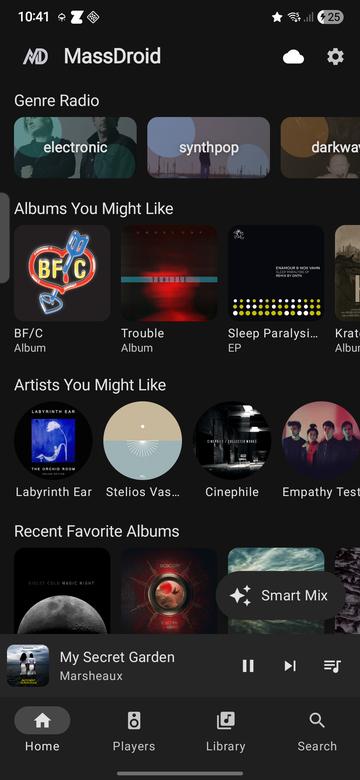&nbsp;&nbsp;
  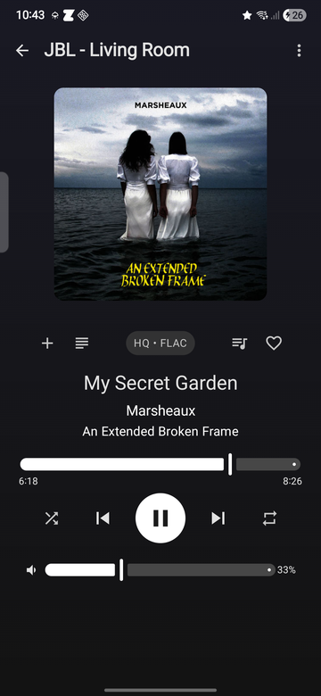&nbsp;&nbsp;
  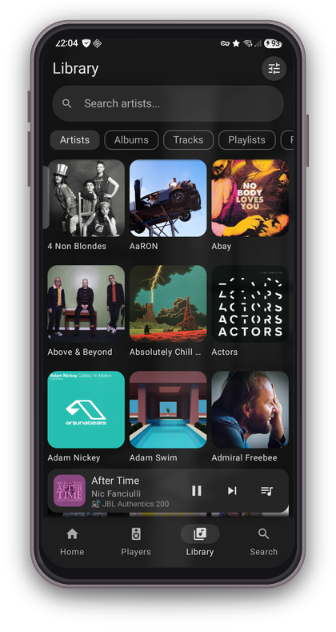

  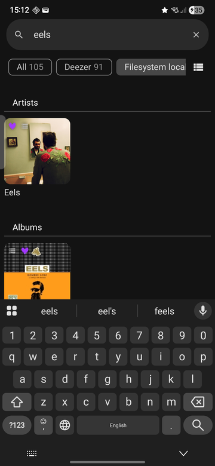&nbsp;&nbsp;
  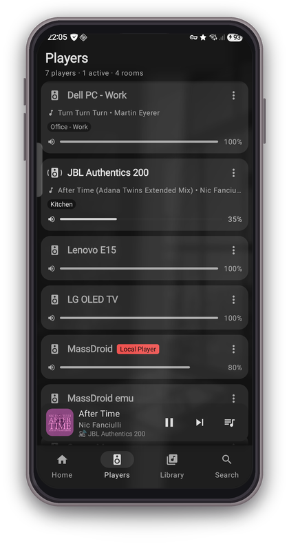&nbsp;&nbsp;
  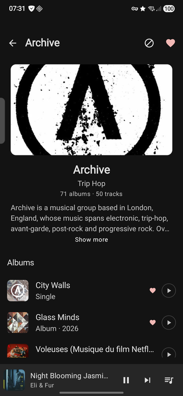

  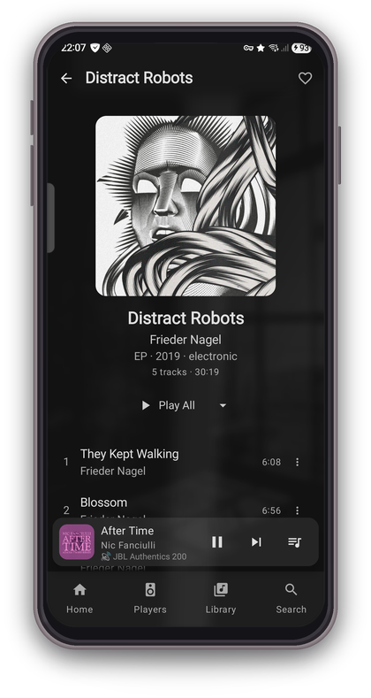&nbsp;&nbsp;
  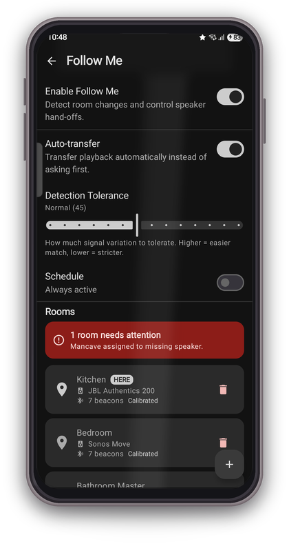&nbsp;&nbsp;
  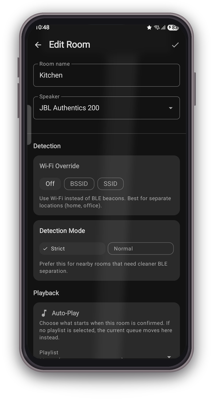

  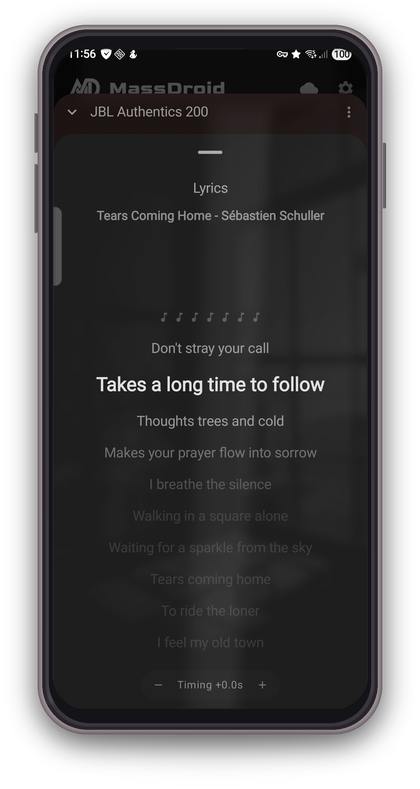&nbsp;&nbsp;
  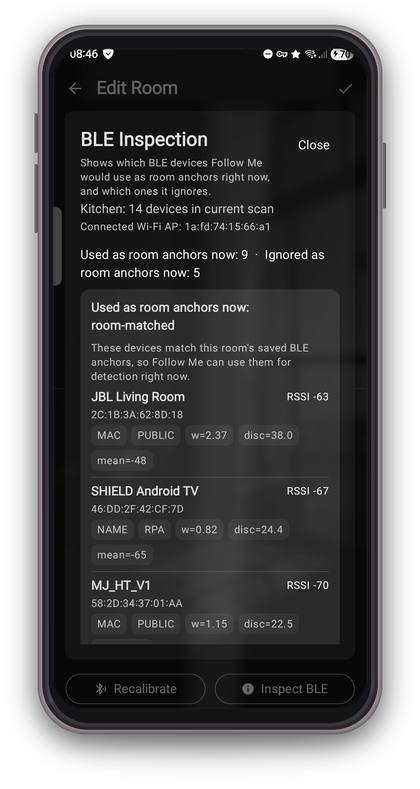

## Exploration & Discovery

- **Similar Artists** : Open any artist and see related artists from Last.fm, resolved across all your music providers. Genre validation ensures name collisions are filtered out. Results are cached locally for fast repeat visits.
- **Last.fm Enrichment** : Artist bios, album descriptions, genres, and release years are pulled from Last.fm when your music provider lacks the data. Everything is cached and reused across the app.
- **Smart Mix** : One tap, instant playlist. The on-device recommendation engine scores artists by recent listening, weighs genre affinity and time-of-day patterns, then builds a queue that fits your current mood. Tracks are interleaved so the same artist never plays back-to-back.
- **Genre Radio** : Pick a genre chip on the Discover screen and get a curated playlist. Artist selection is weighted by your play history to keep the mix personal and fresh.
- **Smart Listening** : Runs silently in the background. Every play, skip, like, and unlike trains a per-artist preference model that decays over 60 days, so the engine adapts as your taste evolves.
- **Recommendation Insights** : View your top artists, albums, and genres, plus manage blocked artists from Settings.

## Follow Me

Walk between rooms and your music follows you. MassDroid uses BLE fingerprinting to detect which room you are in and automatically transfer playback or notify you to switch speakers.

- **BLE Room Detection** : Scans nearby Bluetooth devices (TVs, speakers, routers, IoT) and compares the live BLE anchor snapshot against calibrated room fingerprints using room-fit scoring.
- **Per-Room Configuration** : Assign a Music Assistant player to each room, set a preferred playlist for auto-play, configure volume level, and toggle shuffle.
- **Calibration Wizard** : Walk through each room while the app collects 20 BLE sampling windows, builds anchor fingerprints, and computes beacon profiles with quality assessment (Good/Weak).
- **Time Schedule** : Set active days and times so proximity detection only runs when you want it.
- **Auto-Transfer** : Optionally transfer the queue automatically without notification when you change rooms.
- **Screen-Off Detection** : Works with screen off using PendingIntent BLE scans (OS-managed, no wake locks).
- **Motion Gating** : Sensor hub (significant motion + step detector) triggers scans only when you are actually moving, saving battery.

Requires Android 12+ with Bluetooth support.

### Room Detection Tips

To get reliable room detection, treat each room like a BLE fingerprinting problem, not just a “find the strongest beacon” problem.

- **Calibrate inside the room, not near the doorway** : Doorways blend adjacent-room fingerprints and make transitions less stable.
- **Low signal can still be useful** : A room can have weak BLE beacons and still be detectable if the overall RSSI pattern is consistent and different from nearby rooms.
- **Common beacons are fine** : The same TV, speaker, or router can appear in multiple rooms. What matters is that the RSSI pattern changes between rooms.
- **Prefer stationary devices** : TVs, speakers, consoles, routers, and smart home hubs are good anchors. Phones, watches, earbuds, and other personal devices are intentionally ignored.
- **Private-address devices are not automatically bad** : Some useful devices advertise with private BLE addresses. Use the inspection tools below to see what the app is actually using or ignoring.
- **Use `STRICT` as the default** : Use `NORMAL` only for genuinely weaker rooms that need a more forgiving BLE policy.
- **Use Wi-Fi AP override only for separate locations** : `Stick to connected Wi-Fi AP` is best for distinct places like `Home`, `Office`, or a detached space. It is not meant for nearby rooms on the same Wi-Fi.

### Follow Me Tools

MassDroid includes a few built-in tools to help you tune room detection without guessing:

- **Calibration Data** : Shows the saved room fingerprint, anchor profiles, sample count, and whether the room currently looks `Good` or `Weak`.
- **Recalibrate** : Rebuilds the room fingerprint from fresh BLE scans. Use this after moving devices or if a room keeps misdetecting.
- **Inspect BLE** : Runs a high-accuracy BLE scan and shows:
  - which devices Follow Me would use as room anchors right now
  - which stable devices are visible but not yet in the room profile
  - which devices are ignored because they are mobile or excluded by the current policy
- **Detection Mode** : `STRICT` requires a cleaner BLE match. `NORMAL` is a fallback for weaker rooms.
- **Wi-Fi AP Override** : Lets a room use the currently connected Wi-Fi access point instead of BLE anchors.

### Practical Troubleshooting

- If a room looks good in real life but still shows `Weak`, inspect whether it has a low-signal but structured fingerprint rather than simply “not enough strong beacons”.
- If two nearby rooms confuse each other, recalibrate both away from the doorway and compare their `Inspect BLE` results.
- If a remote location keeps false-triggering from home, store its Wi-Fi AP and enable `Stick to connected Wi-Fi AP`.
- If detection feels slow during movement, test with the screen off as well as screen on. The motion-driven scanning path is more aggressive during real room-to-room movement.

## Recommendation Engine

MassDroid includes a local recommendation engine that learns your listening habits and generates personalized content.

- **BLL Temporal Decay** : Recent plays weigh dramatically more than older ones, even if the old track was played many times.
- **MMR Re-ranking** : Prevents genre clustering by penalizing items too similar to already-selected ones.
- **Genre Adjacency** : Built from co-occurrence in your play history to discover genres you might enjoy.
- **Exploration Budget** : 70% top matches, 20% adjacent genres, 10% wildcard for serendipitous discovery.
- **Last.fm Genre Fallback** : When your music provider has no genre data, the app queries Last.fm artist tags (optional, cached locally for 30 days). Enriched genres are used across the entire app: recommendations, Smart Mix, genre radio, and library search.

All recommendation data stays on-device in a local Room database. Nothing is sent to external services.

## Features

- **Discover Home** : Dynamic recommendation sections with recently played, top picks, genre radio, and Smart Mix
- **Library Browsing** : Artists, Albums, Tracks, Playlists, Radio, and Browse with search, sort, grid/list views, and provider filtering. Genre-based search finds artists, albums, and tracks by genre when your library has been enriched with Last.fm tags.
- **Artist & Album Detail** : Rich detail views with descriptions, genres, similar artists, and now-playing indicators
- **Player Controls** : Play, pause, skip, seek, volume, shuffle, repeat across all MA players
- **Now Playing** : Full-screen player with album art, seek bar, favorite toggle, synced/plain lyrics, tap-to-seek on synced lyric lines, timing adjustment, and artist blocking
- **Queue Management** : View, drag-to-reorder, transfer between players, and manage the playback queue with action sheets
- **Favorites** : Mark artists, albums, tracks, and playlists as favorites, filter library by favorites
- **Phone as Speaker** : Sendspin protocol turns your phone into a Music Assistant player. Audio streams as Opus or FLAC over WebSocket, decoded and played through your phone speaker or headphones. Smart mode can switch format automatically based on network conditions.
- **Follow Me** : BLE fingerprint-based room detection with auto-transfer, per-room playlists, volume, and scheduling
- **Artist Blocking** : Block any artist from all recommendations, radio stations, and Smart Mix results
- **Media Session** : Android media notification with playback controls
- **Player Settings** : Rename players, set icons, configure crossfade and volume normalization
- **Connection Diagnostics** : Live latency graph with roundtrip stats and server version info
- **mTLS Support** : Client certificate authentication for secure remote access
- **MiniPlayer** : Persistent mini player bar across all screens

## Tech Stack

- Kotlin, Jetpack Compose, Material 3
- MVVM, Hilt, Coroutines/Flow
- OkHttp WebSocket, kotlinx.serialization
- Media3 / MediaSession
- Room (local recommendation database)

## How It Works

MassDroid communicates with your Music Assistant server over a persistent WebSocket connection. All player state, library data, queue changes, and favorites are synced in real time through server-pushed events. The app never polls; updates appear instantly as they happen on the server or from other clients.

When Sendspin is enabled, the phone registers as a Music Assistant player. Audio is streamed as Opus or FLAC over a second WebSocket, decoded on-device, and played through the phone speaker or headphones. In Smart mode, the app can switch formats automatically based on network conditions.

## Requirements

- Android 8.0+ (API 26)
- A running [Music Assistant](https://music-assistant.io/) server (v2.x)
- Bluetooth support for Follow Me (room detection)

## Permissions

| Permission | Why |
|---|---|
| Internet | Connect to your Music Assistant server |
| Foreground Service (Media Playback) | Keep media controls and playback active in the background |
| Foreground Service (Connected Device) | BLE scanning for proximity room detection |
| Bluetooth Scan / Connect | Discover nearby BLE devices for room fingerprinting |
| Fine Location | Required by Android for BLE scanning |
| Activity Recognition | Step detector for motion-gated proximity scanning |
| Post Notifications | Show playback controls, proximity room alerts, and update prompts |
| Wake Lock | Keep Sendspin audio streaming while screen is off |
| Battery Optimization Exemption | Reliable background playback and proximity detection |

All permissions are requested at runtime when needed. Proximity-related permissions (Bluetooth, Location, Activity Recognition) are only requested when you enable Follow Me.

## Installation

### Stable release

Download the latest signed APK from [GitHub Releases](https://github.com/sfortis/massdroid_native/releases/latest).

### Dev build (latest features, may be unstable)

The most recent debug build is always available at the [dev-latest release](https://github.com/sfortis/massdroid_native/releases/tag/dev-latest).

> Debug and release builds can be installed side by side (different package IDs). Debug builds are not signed with the release key, so you cannot upgrade from debug to release or vice versa.

## Configuration

### Server connection

1. Open MassDroid and go to **Settings**
2. Enter your Music Assistant server URL (e.g. `http://192.168.1.100:8095`)
3. Log in with your Music Assistant credentials
4. Your players will appear on the Home screen

For remote access with mTLS, install a client certificate on your device and select it in Settings. The app will use it for both WebSocket and image connections.

### Last.fm API key (strongly recommended)

Most of the discovery and enrichment features rely on the [Last.fm](https://www.last.fm/api) API: similar artists, artist bios, album descriptions, genre tags, and release years. Data is only fetched when your music provider lacks the information, and all results are cached locally.

To set it up:

1. Create a free [Last.fm API account](https://www.last.fm/api/account/create) and get your API key
2. Go to **Settings** in MassDroid and enter the key in the **Last.fm API Key** field

Without it the core player and library features work fine, but you will miss out on similar artists, bios, and genre enrichment for Smart Mix and Genre Radio.

## License

This project is licensed under the MIT License. See [LICENSE](LICENSE) for details.
