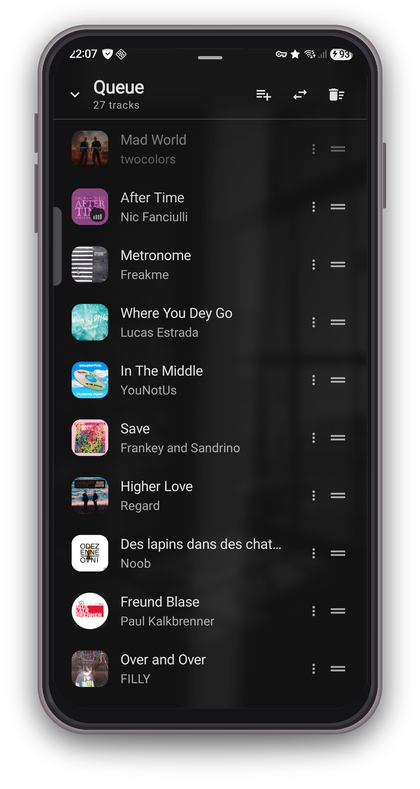
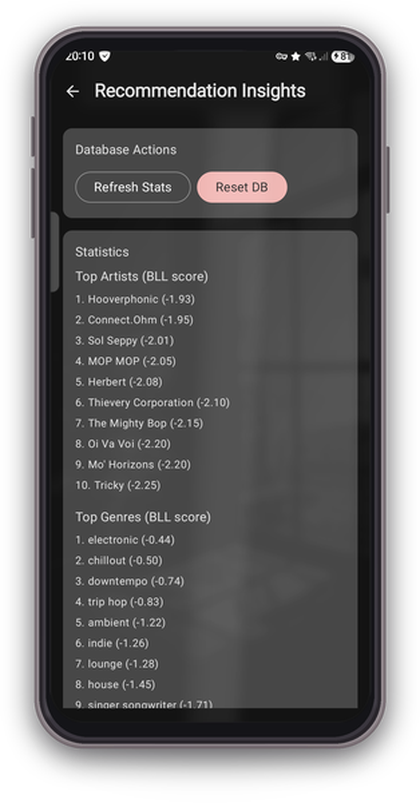
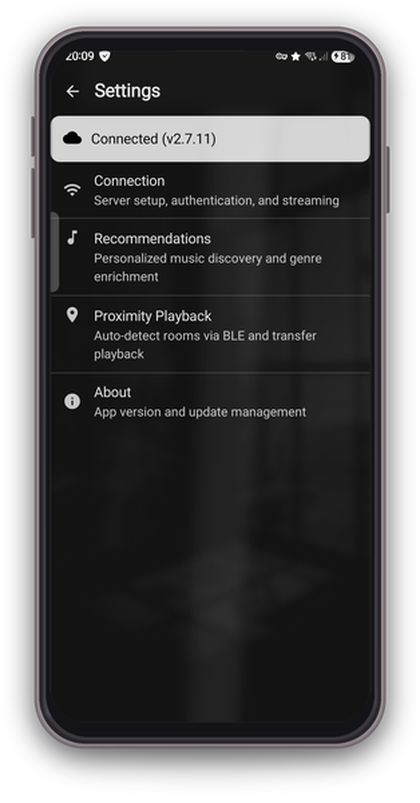

#  MassDroid

Native Android client for [Music Assistant](https://music-assistant.io/), the open-source music server that integrates all your music sources and players.

MassDroid lets you control your Music Assistant players, browse your library, manage queues, and turn your phone into a speaker via the Sendspin protocol. It also includes a local recommendation engine that learns from your listening habits to generate personalized playlists (Smart Mix) and genre-based radio stations, all on-device with no external services.

## Screenshots

<table align="center">
  <tr>
    <td align="center"> Discover Home</td>
    <td align="center"> Now Playing</td>
    <td align="center"> Library</td>
  </tr>
  <tr>
    <td align="center"> Players</td>
    <td align="center"> Queue</td>
    <td align="center"> Smart Listening</td>
  </tr>
  <tr>
    <td align="center"> Artist Detail</td>
    <td align="center"> Connection Diagnostics</td>
    <td></td>
  </tr>
</table>

## Hot Features

- **Smart Mix** : One tap, instant playlist. The on-device recommendation engine scores artists by recent listening, weighs genre affinity and time-of-day patterns, then builds a queue that fits your current mood. Tracks are interleaved so the same artist never plays back-to-back.
- **Genre Radio** : Pick a genre chip on the Discover screen and get a curated playlist. Artist selection is weighted by your play history to keep the mix personal and fresh.
- **Phone as Speaker** : Flip the Sendspin toggle and your phone becomes a Music Assistant player. Audio streams as Opus frames over WebSocket, decoded and played through your phone speaker or headphones.
- **Smart Listening** : Runs silently in the background. Every play, skip, like, and unlike trains a per-artist preference model that decays over 60 days, so the engine adapts as your taste evolves.
- **Artist Blocking** : Block any artist from all recommendations, radio stations, and Smart Mix results. Available from artist detail, now playing, and action sheets.
- **Connection Diagnostics** : Tap the cloud icon for a live latency graph with roundtrip stats and server version info.

## Smart Mix & Recommendation Engine

MassDroid includes a local recommendation engine that learns your listening habits and generates personalized content.

- **BLL Temporal Decay** : Recent plays weigh dramatically more than older ones, even if the old track was played many times.
- **MMR Re-ranking** : Prevents genre clustering by penalizing items too similar to already-selected ones.
- **Genre Adjacency** : Built from co-occurrence in your play history to discover genres you might enjoy.
- **Exploration Budget** : 70% top matches, 20% adjacent genres, 10% wildcard for serendipitous discovery.
- **Last.fm Fallback** : When your music provider has no genre data, the app can query Last.fm artist tags as a fallback (optional, cached locally).
- **Recommendation Insights** : View your top artists, albums, and genres, plus manage blocked artists from Settings.

All recommendation data stays on-device in a local Room database. Nothing is sent to external services.

## Features

- **Player Controls** : Play, pause, skip, seek, volume, shuffle, repeat across all MA players
- **Discover Home** : Dynamic recommendation sections with recently played, top picks, genre radio, and Smart Mix
- **Library Browsing** : Artists, Albums, Tracks, Playlists with search, sort, and grid/list views
- **Now Playing** : Full-screen player with album art, seek bar, favorite toggle, and artist blocking
- **Queue Management** : View, drag-to-reorder, transfer between players, and manage the playback queue with action sheets
- **Favorites** : Mark artists, albums, tracks, and playlists as favorites, filter library by favorites
- **Media Session** : Android media notification with playback controls
- **Player Settings** : Rename players, set icons, configure crossfade and volume normalization
- **mTLS Support** : Client certificate authentication for secure remote access
- **MiniPlayer** : Persistent mini player bar across all screens

## Tech Stack

- Kotlin, Jetpack Compose, Material 3
- MVVM, Hilt, Coroutines/Flow
- OkHttp WebSocket, kotlinx.serialization
- Media3 / MediaSession

## How It Works

MassDroid communicates with your Music Assistant server over a persistent WebSocket connection. All player state, library data, queue changes, and favorites are synced in real time through server-pushed events. The app never polls; updates appear instantly as they happen on the server or from other clients.

When Sendspin is enabled, the phone registers as a Music Assistant player. Audio is streamed as Opus frames over a second WebSocket, decoded on-device, and played through the phone speaker or headphones.

## Requirements

- Android 8.0+ (API 26)
- A running [Music Assistant](https://music-assistant.io/) server (v2.x)

## Configuration

### Server connection

1. Open MassDroid and go to **Settings**
2. Enter your Music Assistant server URL (e.g. `http://192.168.1.100:8095`)
3. Log in with your Music Assistant credentials
4. Your players will appear on the Home screen

For remote access with mTLS, install a client certificate on your device and select it in Settings. The app will use it for both WebSocket and image connections.

### Last.fm API key (optional)

Genre data from music providers is often incomplete or missing entirely. Some providers return no genres at all, which limits the quality of Smart Mix, Genre Radio, and recommendations.

To fill the gaps, MassDroid can use the [Last.fm](https://www.last.fm/api) API as a fallback source for artist genre tags. When enabled, the app queries Last.fm only when Music Assistant has no genre data for an artist. Results are cached locally for 30 days.

To set it up:

1. Create a free [Last.fm API account](https://www.last.fm/api/account/create) and get your API key
2. Go to **Settings** in MassDroid and enter the key in the **Last.fm API Key** field

This is entirely optional. Without it, the app still works, but genre-based features will only have data from whatever your music providers supply.

## License

This project is licensed under the MIT License. See [LICENSE](LICENSE) for details.
